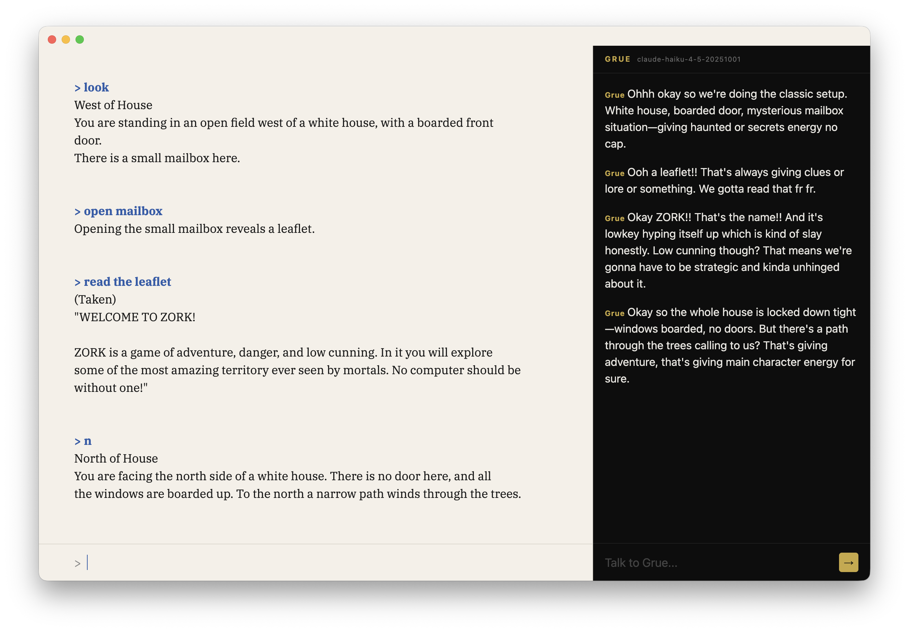

# IF-PAL

Play classic text adventure games with a gen alpha AI companion watching over your shoulder.



IF-PAL runs Z-machine games (Zork, Hitchhiker's Guide, etc.) in a clean serif reader view, with **Grue** — an gen alpha AI friend — reacting to what happens in the game in real time.

---

## Requirements

- [Node.js](https://nodejs.org) (v18+)
- [dfrotz](https://github.com/DavidGriffith/frotz) — the Z-machine interpreter
- A Z-machine game file (`.z3`, `.z5`, or `.z8`)
- Either [Ollama](https://ollama.ai) (local, free) or an [Anthropic API key](https://console.anthropic.com) for Grue

Install dfrotz on macOS:

```sh
brew install frotz
```

---

## Setup

```sh
git clone <repo>
cd if-pal
npm install
cp settings.example.json settings.json
```

Edit `settings.json` for your preferred AI backend (see below), then:

```sh
npm run dev
```

Click **Open a game...** and pick a `.z3` file to start playing.

---

## Configuration

Settings live in `settings.json` at the project root. This file is gitignored — copy from `settings.example.json` to get started.

### Using Ollama (local, free)

Install Ollama and pull a model:

```sh
brew install ollama
ollama pull llama3.2:3b
```

> **Apple Silicon note:** If you hit errors on M-series Macs, start Ollama with:
> ```sh
> GGML_METAL_TENSOR_DISABLE=1 ollama serve
> ```

`settings.json`:

```json
{
  "provider": "ollama",
  "model": "llama3.2:3b",
  "ollamaPort": 11434,
  "debounceMs": 1500
}
```

Any model available in Ollama will work. Smaller models (1–4B) are fast; larger ones (7B+) are more interesting but slower.

### Using Claude (Anthropic API)

Sign up at [console.anthropic.com](https://console.anthropic.com), create an API key, and add credits.

`settings.json`:

```json
{
  "provider": "claude",
  "model": "claude-haiku-4-5-20251001",
  "ollamaPort": 11434,
  "debounceMs": 1500,
  "anthropicApiKey": "sk-ant-..."
}
```

Recommended models:
- `claude-haiku-4-5-20251001` — fast and cheap, great for Grue
- `claude-sonnet-4-6` — more thoughtful, higher cost

---

## Settings reference

| Key | Default | Description |
|-----|---------|-------------|
| `provider` | `"ollama"` | `"ollama"` or `"claude"` |
| `model` | `"qwen2.5:3b"` | Model name for the chosen provider |
| `ollamaPort` | `11434` | Port Ollama is listening on |
| `debounceMs` | `1500` | How long to wait after a game turn before Grue responds (ms) |
| `anthropicApiKey` | — | Your Anthropic API key (required if `provider` is `"claude"`) |

---

## Where to get game files

The [Interactive Fiction Archive](https://ifarchive.org) has hundreds of free Z-machine games. The Infocom classics (Zork, Hitchhiker's Guide, Planetfall) are widely available.
